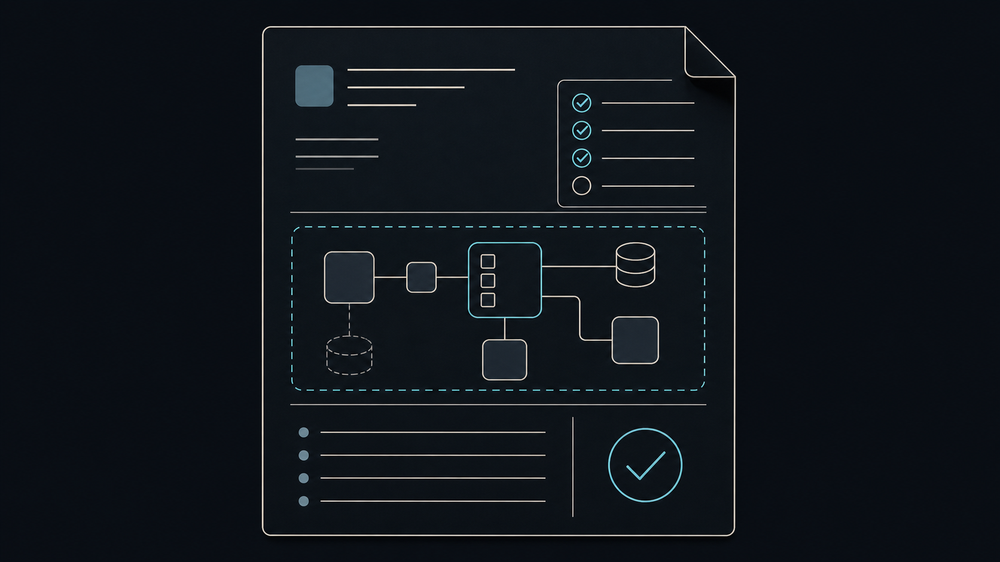
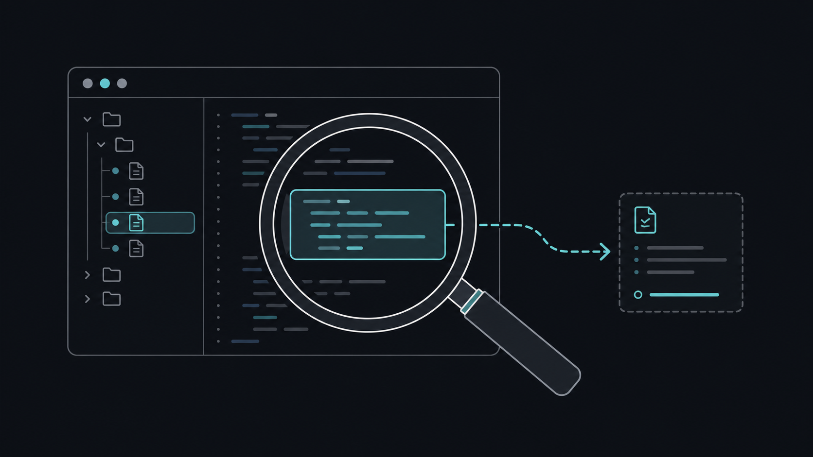
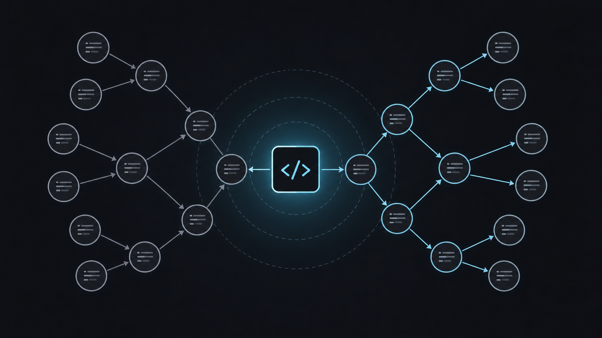
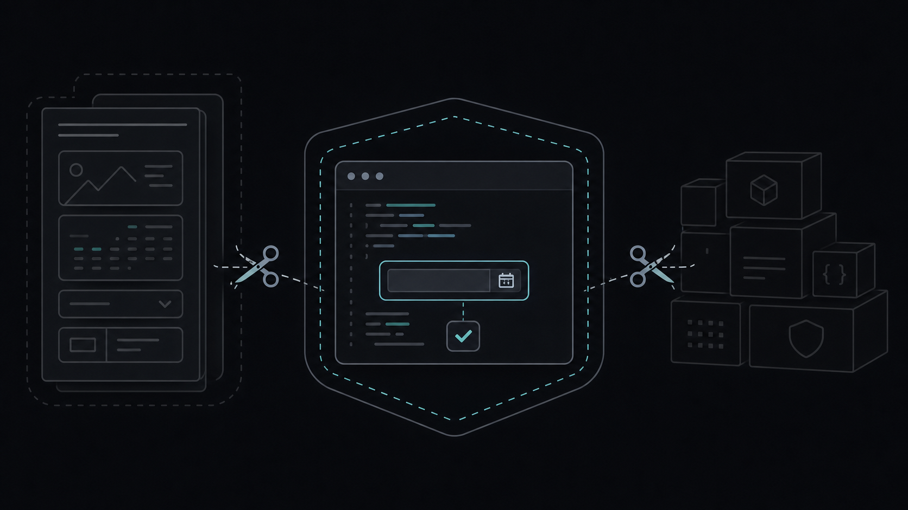

에이전트에게 개발을 맡길 때는 코드를 빨리 쓰게 하는 것보다, 어디서 멈춰 생각하게 할지가 더 중요했다. 나는 새 작업을 시작할 때 `plan-start`로 범위를 정하고, `search-first`로 기존 코드를 찾는다. 변경이 넓어 보이면 `codegraph`로 연결을 확인한 뒤, Ponytail 기준으로 가장 작은 해결책을 고른다.

## plan-start: 만들기 전에 합의하기

`plan-start`는 새 기능이나 여러 파일을 건드리는 작업에서 구현을 잠시 멈추게 한다. 목표, 이번에 하지 않을 범위, 영향 파일, 예외 상황, 검증 기준을 `plan.md`, `context.md`, `todo.md`로 정리한 다음 승인을 받고 시작한다.

작은 문구 수정에는 과하다. 대신 요구가 커졌거나 구조를 바꿔야 할 때, "무엇을 만들지"를 먼저 맞춰 두면 중간에 방향이 흔들리는 일이 줄어든다.



```text
회원가입 기능을 추가하고 싶어.
plan-start로 목표, 하지 않을 범위, 영향 파일, 예외 상황, 검증 기준부터 정리해 줘.
```

## search-first: 이미 있는 것을 먼저 찾기

`search-first`는 새 유틸이나 래퍼를 만들기 전에 저장소를 검색하는 습관이다. 비슷한 구현, 호출부, 테스트, 공식 문서를 먼저 확인하고 재사용·확장·새 구현 중 하나를 고른다.

에이전트는 그럴듯한 코드를 금방 만들지만, 기존 책임자를 놓치면 같은 기능이 두 곳에 생긴다. 검색 결과와 선택 이유를 남기면 다음 작업에서도 판단을 다시 할 필요가 적다.



```text
캐시 유틸을 새로 만들기 전에,
저장소에 같은 책임의 유틸·호출부·테스트가 있는지 찾아줘.
재사용, 확장, 새 구현 중 무엇이 맞는지도 이유와 함께 알려줘.
```

## codegraph: 연결된 코드를 보기

`codegraph`는 `.codegraph` 인덱스가 준비된 저장소에서 쓴다. 특정 함수의 호출자와 피호출자, 변경 영향, 관련 테스트 후보를 따라가며 수정 범위를 살필 수 있다. 인덱스가 없거나 최신 상태가 확실하지 않으면 파일을 직접 읽고 `search-first` 방식으로 돌아가면 된다. [CodeGraph 공식 저장소](https://github.com/colbymchenry/codegraph)

공용 함수나 낯선 영역을 건드릴 때 특히 유용하다. 단순 문자열 수정처럼 영향이 명확한 작업에는 굳이 꺼내지 않는다.



```text
UserService를 바꾸기 전에 codegraph로 호출자와 영향 범위를 확인해 줘.
영향을 받는 파일과 테스트 후보를 정리하고 최신 소스도 직접 확인해 줘.
```

## Ponytail: 가장 작은 해결책 고르기

Ponytail은 "새 코드를 꼭 써야 하나"부터 묻는다. 기존 코드, 표준 라이브러리, 플랫폼 기본 기능, 이미 설치된 의존성 순으로 확인하고, 마지막에만 최소 구현을 선택한다. 검증, 오류 처리, 보안, 접근성은 줄일 대상이 아니다. [Ponytail 공식 저장소](https://github.com/DietrichGebert/ponytail)

새 라이브러리와 래퍼를 늘리기 전에 브라우저나 프레임워크가 이미 할 수 있는 일인지 보는 기준으로 좋았다.



```text
날짜 선택 UI가 필요해.
Ponytail 기준으로 기존 코드와 브라우저 기본 기능을 먼저 확인하고,
새 의존성 없이 가능한 가장 작은 구현을 제안해 줘.
```

## 내가 쓰는 순서

요청이 크면 `plan-start`로 범위를 맞춘다. 그다음 `search-first`로 기존 패턴을 찾고, 연결이 복잡할 때만 `codegraph`를 더한다. 마지막으로 Ponytail 기준을 적용해 필요한 만큼만 바꾼다. 이 순서가 정답은 아니다. 다만 에이전트가 일을 크게 벌이기 전에 한 번 멈추게 하는 안전장치로는 잘 맞았다.

## 참고 자료

- [CodeGraph 공식 저장소](https://github.com/colbymchenry/codegraph)
- [Ponytail 공식 저장소](https://github.com/DietrichGebert/ponytail)
