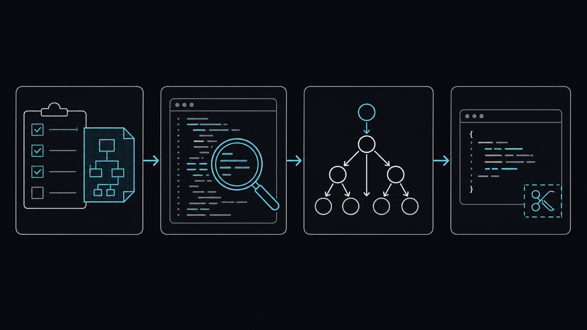

에이전트에게 개발을 맡길 때, 좋은 결과는 코드를 빨리 쓰는 데서만 나오지 않습니다. 무엇을 만들지 정하고, 이미 있는 것을 찾고, 영향 범위를 확인한 뒤 필요한 만큼만 구현하는 순서가 더 중요했습니다.

요즘은 `plan-start`, `search-first`, `codegraph`, Ponytail을 이 흐름으로 함께 씁니다. 네 스킬은 만능 도구라기보다, 과한 구현으로 흘러가기 쉬운 순간을 각각 막아 주는 역할에 가깝습니다.



*왼쪽부터 계획을 세우고, 기존 코드를 찾고, 연결된 영향을 확인한 뒤, 필요한 만큼만 구현합니다.*

## 1. plan-start로 범위 정하기

`plan-start`는 새 기능이나 여러 파일에 걸친 변경을 바로 구현하지 않고, 목표·범위·영향·검증 기준을 먼저 정리하게 합니다. 특히 "여기까지 해 줘"라는 요청이 커질수록 이번 작업에서 하지 않을 일을 적어 두는 편이 도움이 됩니다.

작은 문구 수정에는 과합니다. 하지만 기능을 새로 만들거나 구조를 바꾼다면, 구현 전에 승인 가능한 계획을 두는 것만으로도 방향이 흔들리는 일을 줄일 수 있습니다.

**핵심 흐름**: `plan.md`에 목표와 범위를 정리하고, `context.md`에 기존 규칙을 남기며, `todo.md`를 실행 단위로 나눕니다. 계획을 본 뒤 승인을 받아 구현으로 넘어가는 구조입니다.

**사용 예시**

```text
회원가입 기능을 추가하고 싶어. plan-start로 목표, 하지 않을 범위,
영향 파일, 예외 상황, 검증 기준을 먼저 정리해 줘.
```

## 2. search-first로 기존 코드 찾기

`search-first`의 출발점은 단순합니다. 새 유틸이나 래퍼를 만들기 전에 저장소와 공식 문서부터 살펴보는 것입니다. 이미 있는 책임자를 재사용할지, 조금 확장할지, 정말 새 구현이 필요한지 판단하는 단계입니다.

에이전트는 그럴듯한 코드를 빠르게 만들지만, 기존 패턴을 놓치면 중복이 생기기 쉽습니다. 검색 결과와 결정 이유를 남기면 다음 작업에서 같은 기능을 다시 만들 가능성도 줄어듭니다.

**핵심 흐름**: 저장소 검색으로 기존 책임자를 찾고, 비슷한 호출부와 테스트를 비교합니다. 외부 라이브러리가 필요할 때만 공식 문서까지 확인한 뒤 재사용·확장·새 구현 중 하나를 고릅니다.

**사용 예시**

```text
캐시 유틸을 새로 만들기 전에, 저장소에 같은 책임의 유틸이나 패턴이 있는지 찾아줘.
재사용, 확장, 새 구현 중 무엇이 맞는지도 이유와 함께 알려줘.
```

## 3. codegraph로 코드 연결 확인

`codegraph`는 `.codegraph` 인덱스가 준비된 저장소에서 특히 유용합니다. 특정 함수의 호출자와 피호출자, 변경 영향, 관련 테스트를 따라가며 수정 범위를 살펴봅니다. [CodeGraph 공식 저장소](https://github.com/colbymchenry/codegraph)

문자열 검색만으로 충분한 작은 변경도 많습니다. 다만 공용 함수나 낯선 영역을 바꿀 때는 코드가 어디와 연결되어 있는지 먼저 보는 편이 안전합니다. 인덱스가 없거나 최신 상태가 확실하지 않으면 직접 파일을 읽고 `search-first` 방식으로 돌아가면 됩니다.

**핵심 흐름**: 먼저 `codegraph status`로 인덱스 상태를 확인합니다. 그다음 `callers`, `callees`, `impact` 같은 질의로 호출 관계를 살핀 뒤, 최신 파일은 직접 읽어 결과를 교차 확인합니다.

**사용 예시**

```text
UserService를 바꾸기 전에 codegraph로 호출자와 변경 영향 범위를 확인해 줘.
영향을 받는 파일과 테스트 후보를 정리하고, 최신 소스도 직접 확인해 줘.
```

## 4. Ponytail로 최소 구현 고르기

Ponytail은 해결책을 고르기 전에 "이 기능이 정말 필요한가"부터 묻는 스킬입니다. 필요하다면 기존 코드, 표준 라이브러리, 브라우저나 프레임워크의 기본 기능, 이미 설치된 의존성 순서로 확인하고, 마지막에만 최소 구현을 선택합니다.

핵심은 짧은 코드 자체가 아닙니다. Ponytail도 검증, 오류 처리, 보안, 접근성은 줄일 대상이 아니라고 명시합니다. 읽고 이해하는 과정은 생략하지 않되, 날짜 선택기에 새 라이브러리와 래퍼를 추가하는 식의 과한 구현은 피하자는 기준입니다. Codex를 포함한 여러 에이전트용 어댑터와 설치 방법도 함께 제공합니다. [Ponytail 공식 저장소](https://github.com/DietrichGebert/ponytail)

**핵심 흐름**: 필요성부터 확인하고, 기존 코드 → 표준 라이브러리 → 플랫폼 기본 기능 → 설치된 의존성 → 한 줄 구현 → 최소 구현 순서로 선택지를 좁힙니다. 안전을 위한 검증과 접근성은 이 절약 대상에 넣지 않습니다.

**사용 예시**

```text
날짜 선택 UI를 추가해야 해. Ponytail 기준으로 기존 코드와 브라우저 기본 기능을 먼저 확인하고,
새 의존성 없이 해결할 수 있는 가장 작은 구현을 제안해 줘.
```

## 내가 쓰는 순서

예를 들어 검색 필터를 고친다고 하면 먼저 `plan-start`로 동작과 예외를 정합니다. `search-first`로 기존 필터와 유틸을 찾고, 영향이 넓어 보이면 `codegraph`로 호출 관계를 확인합니다. 그다음 Ponytail의 기준으로 가장 작은 변경을 고릅니다. 마지막의 리뷰와 빌드는 생략하지 않습니다.

이 순서는 고정 규칙은 아닙니다. 단순한 한 줄 수정에는 계획이나 인덱스가 필요 없고, `codegraph`도 인덱스가 있을 때만 쓸 수 있습니다. 그래도 에이전트가 일을 크게 벌이기 전에 한 번 멈추게 만드는 기준으로는 이 네 가지 조합이 잘 맞았습니다.

## 참고 자료

- [CodeGraph 공식 저장소 — 호출 관계와 영향 범위 분석](https://github.com/colbymchenry/codegraph)
- [Ponytail 공식 저장소 — 최소 구현을 고르는 기준과 Codex 지원](https://github.com/DietrichGebert/ponytail)
